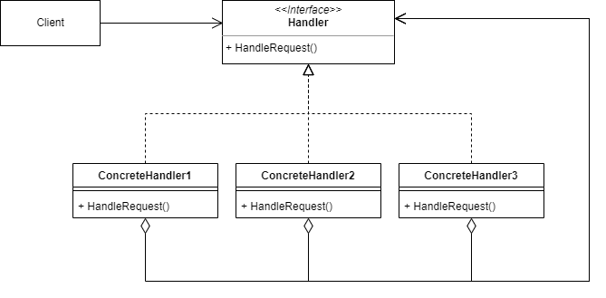

# 책임연쇄패턴

- 클라이언트의 요청에 대한 처리를 여러개의 처리 객체로 나눠, 이들을 사슬(chain)처럼 연결해 집합 안에서 연쇄적으로 처리하는 패턴

- Handler : 요청을 수신하고 처리 객체들의 집합을 정의하는 인터페이스
- ConcreteHandler: 요청을 처리하는 실제 처리 객체

### 장점

1. 클라이언트는 처리 객체의 체인 집합 내부 구조를 알 필요가 없음

2. 각각의 체인은 자신이 해야하는 일만 하기 때문에, 새로운 요청에 대한 처리객체 생성이 편리

3. 클라이언트 코드를 변경하지 않고 핸들러를 체인에 동적으로 추가하거나, 처리 순서의 변경과 삭제 할 수 있어 유연해짐

### 단점

1. 실행 시에 코드의 흐름이 많아져 디버깅과 테스트가 어려움

2. 집합 내부에서 무한 사이클이 발생할 수 있음

3. 요청이 반드시 수행된다는 보장이 없음

4. 책임 연쇄로 인한 처리 지연 문제가 발생할 수 있음

### 결론
- 특정 요청을 2개 이상의 여러 객체에서 판별하고 처리해야 할 때 사용
- 특정 순서로 여러 핸들러를 실행해야 할 경우에 사용
- 요청을 처리할 수 잇는 객체 집합이 동적으로 정의되어야할 때 유용
