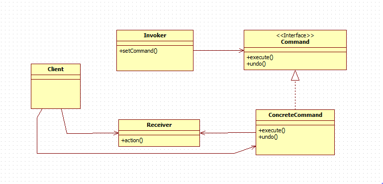

# 커맨드 패턴

- 객체의 행위(메소드)를 클래스로 만들어 캡슐화하는 패턴

- Command : 실행될 기능에 대한 인터페이스, 실행될 기능을 execute 메서드로 선언
- ConcreteCommand : 실제로 실행될 기능을 구현
- Invoker : 기능의 실행을 요청하는 호출자 클래스
- Receiver :  ConcreateCommand에서 execute 메서드를 구현할 때 필요한 클래스, ConcreateCommand의 기능을 실행하기 위해 사용하는 수신자 클래스

### 장점

1. 기존의 코드를 수정하지 않고 새로운 명령을 추가 가능

2. 명령의 호출자와 수신자간의 의존성을 제거 

### 단점

1. 명령에 대한 클래스의 수가 증가

### 결론
- 커맨드 패턴을 활용하면 요청과 실행을 분리가능, 이를 통해 프로그램의 유연성과 확장성을 높일 수 있음
