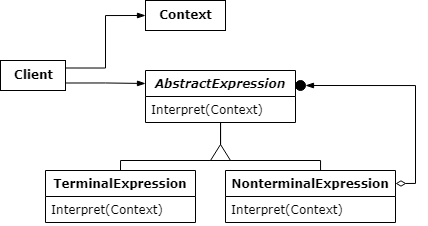

# 인터프리터 패턴

- 간단한 언어의 문법을 정의하고 해석하는 패턴
- 언어가 주어지면 해당 표현을 사용하여 언어로 문장을 해석하는 인터프리터를 사용하여 문법 표현을 정의하는 방법

- Context : Expression에서 사용하는 모든 데이터들이 저장되어있는 공간
- Expression : 일련의 규칙을 계산하여 결과값을 반환
- TerminalExpression : Expression을 포함하지 않고 계산된 결과값을 반환
- NonTerminalExpression : Expression을 참조하여 종료를 하지않고 다음 규칙으로 값을 넘기는 클래스

### 장점

1. 관심사 분리
    - 문법과 해석을 기본 로직에서 분리하여 별도의 클래스로 캡슐화되기 때문에 유지보수가 쉬움

2. 확장
    - Expression에서 파생된 새로운 구현 클래스만 추가하면 되기 때문에 확장이 용이

3. 가독성
    - 문법과 규칙을 계층 구조로 모델링되기 때문에 가독성 증가
    - 문법과 요소의 관계를 이해하기 쉬움

### 단점

1. 복잡성
    - DSL이 크고 복잡한 경우 별도의 클래스가 많이 생성되기 때문에 관리와 이해가 어려워짐

2. 성능
    - 많은 객체를 생성해야 하기 때문에 오버헤드가 발생할 수도 있음
   
3. 적용
    - 문법이 자주 바뀌는 경우 유지 관리의 비용이 증가
