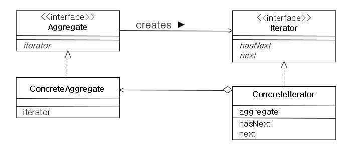

# 이터레이터(반복자) 패턴

- 컬렉션 구현 방법을 노출시키지 않고, 그 집합체 안에 들어있는 모든 항목에 접근할 수 있도록 해주는 패턴
- 집합체 내에서 어떤 식으로 일이 처리되는지 몰라도, 그 안에 들어있는 항목들에 대해 반복 작업을 수행 가능

- Iterator : 집합체의 요소들을 순서대로 검색하기 위한 인터페이스를 정의
- ConcreteIterator : Iterator 인터페이스 구현
- Aggregate : 여러 요소들로 이루어져 있는 집합체
- ConcreteAggregate : Aggregate 인터페이스 구현

### 장점

1. 일관된 이터레이터 인터페이스를 통해 여러 형태의 컬렉션에 대해 동일한 순회 방법 제공

2. 집합체의 구현과 접근을 반복자 객체로 분리하여 결합도를 낮출 수 있음

3. 각 클래스의 책임이 분리되어 단일 책임 원칙(SRP) 만족

4. 데이터 저장 컬렉션의 종류가 바뀌어도 클라이언트의 코드는 바꾸지 않아도 되기 때문에 개방 폐쇄 원칙(OCP) 만족

### 단점

1. 클래스와 복잡도가 증가

2. 구현 방법에 따라 캡슐화를 위배할 수 있음

### 결론

- 정의한 방법과 다른 방법으로 요소들을 순회할 때 유용
