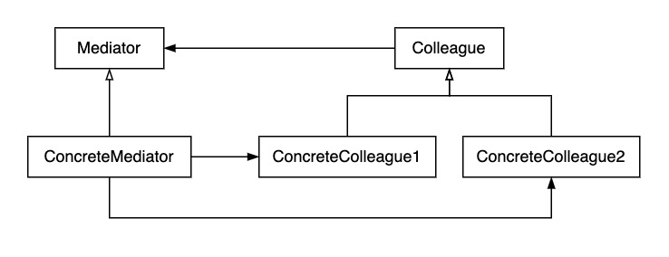

# 중재자 패턴

- 객체들 간의 상호작용을 캡슐화하여 하나의 클래스에 위임하여 처리하는 패턴

- Mediator : Colleague와 상호작용을 위한 인터페이스 제공
- ConcreteMediator : Mediator 구현
- Colleague : 다른 Colleague와 상호작용를 위한 인터페이스 제공
- ConcreteColleague : Colleague 구현

### 장점

1. 관심사 분리
    - 문법과 해석을 기본 로직에서 분리하여 별도의 클래스로 캡슐화되기 때문에 유지보수가 쉬움

2. 확장
    - Expression에서 파생된 새로운 구현 클래스만 추가하면 되기 때문에 확장이 용이

3. 가독성
    - 문법과 규칙을 계층 구조로 모델링되기 때문에 가독성 증가
    - 문법과 요소의 관계를 이해하기 쉬움

### 단점

1. 복잡성
    - DSL이 크고 복잡한 경우 별도의 클래스가 많이 생성되기 때문에 관리와 이해가 어려워짐

2. 성능
    - 많은 객체를 생성해야 하기 때문에 오버헤드가 발생할 수도 있음
   
3. 적용
    - 문법이 자주 바뀌는 경우 유지 관리의 비용이 증가
