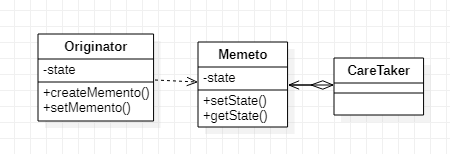

# 메멘토 패턴

- 객체의 상태 정보를 가지는 클래스를 생성하여, 객체의 상태를 저장하거나 이전 상태로 복원할 수 있게 해주는 패턴
- 원하는 시점의 상태로 복구가 가능

- Memento : 상태를 저장하는 클래스
- Originator : 현재 상태를 가지는 객체, Memento 객체의 상태를 얻을 수 있
- Caretaker : Memento를 저장하고 관리하는 클래스

### 장점

1. 상태의 캡슐화를 통해 객체의 불변성 보장

2. 저장된 상태를 핵심 객체와는 다른 객체에 보관하기 때문에 안전

### 단점

1. 많은 정보를 저장하는 Mementor을 자주 사용하는 경우 메모리의 사용량에 많은 영향을 끼침

### 결론

- 객체를 이전의 상태로 복구시켜야 하는 경우가 존재할 때 유용