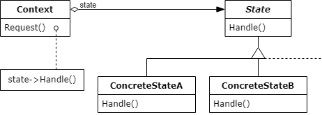

# 상태 패턴

- 객체가 특정 상태에 따라 행위를 달리하는 상황에서, 상태를 객체화하여 필요에 따라 다르게 행동하도록 위임하는 패턴
- 객체 자신이 직접 상태를 체크하여 상태에 따라 행위를 호출하지 않음

- State : 상태에 대한 공통된 인터페이스를 제공
- ConcreteState : Context 객체가 요청한 작업을 자신의 방식으로 구현
- Context : State를 이용하는 역할을 하는 클래스

### 장점

1. 하나의 객체에 대한 여러 동작을 구현해야할 때 상태 객체만 수정하면 되므로, 동작의 추가나 변경이 간단

2. 객체의 상태에 따른 조건문의 감소, 이에 따른 가독성 증가

### 단점

1. 상태 객체가 증가하므로 관리해야 할 클래스가 많아짐
