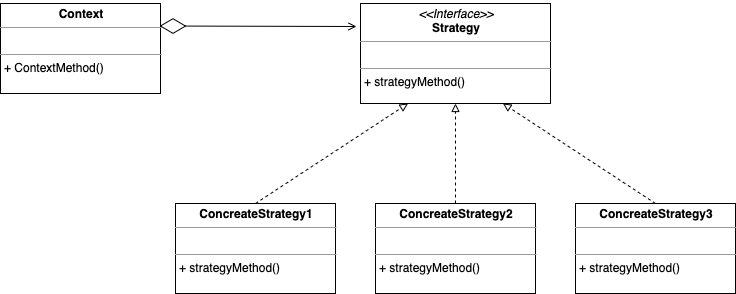

# 전략 패턴

- 실행 중에 알고리즘 전략을 선택하여 객체 동작을 실시간으로 바뀌도록 할 수 있게 하는 패턴 

- Context : 알고리즘을 실행해야 할 때마다 해당 알고리즘과 연결된 전략 객체의 메소드를 호출
- Strategy : 전략 구현체에 대한 공용 인터페이스
- ConcreteStrategy : 알고리즘, 행위, 동작을 객체로 정의한 구현체

### 장점

1. 공통 로직이 부모 클래스에 있지 않고, 별도의 클래스에 존재하기 때문에 구현체들에 대한 영향도가 적음

2. 새로운 전략을 추가하더라도 기존의 코드를 변경하지 않음

3. 런타임 도중에 전약을 변경 가능

### 단점

1. 알고리즘이 많아질수록 관리해야 할 객체의 수가 증가

2. 적절한 전략을 선택하기 위해 전략 간의 차이점을 파악하고 있어야 하기 때문에 복잡도가 증가

### 결론

- 알고리즘의 동작이 런타임에 실시간으로 교체되어야 할 때 유용
