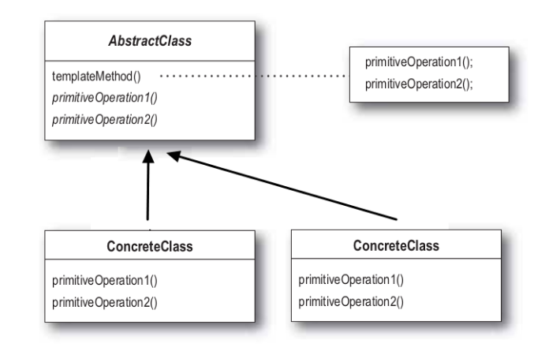

# 템플릿 메서드 패턴

- 여러 클래스에서 공통으로 사용하는 메서드를 템플릿화 하여 상위 클래스에서 정의하고, 하위 클래스마다 세부 동작을 다르게 구현하는 패턴

- AbstractClass : 템플릿 메소드를 구현하고, 템플릿 메소드에서 돌아가는 추상 메소드를 선언
- ConcreteClass : AbstractClass를 상속하고 추상 메소드를 구체적으로 구현

### 장점

1. 클라이언트가 알고리즘의 특정 부분만 재정의하기 때문에, 알고리즘의 다른 부분에 발생하는 변경 사항의 영향을 덜 받음

2. 상위 추상 클래스로 로직을 공통화 하여 코드의 중복을 줄일 수 있음

3. 서브 클래스의 역할을 줄이고, 핵심 로직을 상위 클래스에서 관리하기 때문에 관리가 용이

### 단점

1. 알고리즘 구조가 복잡할수록 템플릿 로직 형태를 유지하기 어려워짐

2. 추상 메소드가 많아지면서 클래스의 생성, 관리가 어려워짐

3. 로직에 변화가 생겨 상위 클래스를 수정할 때, 모든 서브 클래스의 수정이 필요 할수도 있음

### 결론

- 클라이언트가 알고리즘의 특정 단계에서만 확장하고, 전체 알고리즘이나 해당 구조는 확장하지 않도록 할때 유용
- 동일한 기능은 상위 클래스에서 정의하면서 확장, 변화가 필요한 부분만 하위 클래스에서 구현할 때 유용