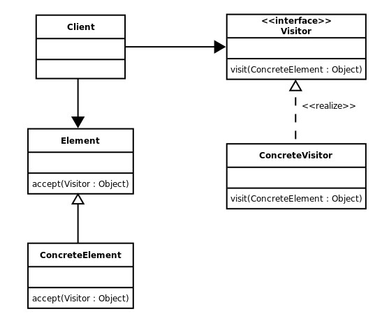

# 방문자 패턴

- 객체의 구조와 그 구조에서 수행되는 작업을 분리하여 구현하는 패턴
- 데이터와 메소드를 구분

- Element : 방문자가 방문할 객체들의 공통 인터페이스
- ConcreteElement : 방문자가 방문할 실제 객체
- Visitor : Element 객체들을 방문하는 메소드를 선언한 인터페이스
- ConcreteVisitor : Element 객체들을 방문하는 구체적인 방법들을 구현

### 장점

1. 객체 구조를 수정하지 않고 새로운 동작을 추가 가능

2. 새로운 동작을 쉽게 추가하고 확장 가능

3. 객체 구조를 신경쓰지 않고 새로운 동작을 만들 수 있어, 유지보수가 용이

### 단점

1. 객체 구조에 대한 정보를 얻기 위해 새로운 방문자 클래스를 생성해야 함

2. 객체 구조의 변경으로 인해 방문자 클래스를 수정해야 할 수도 있음

3. 로직에 변화가 생겨 상위 클래스를 수정할 때, 모든 서브 클래스의 수정이 필요 할수도 있음

### 결론

- 많은 데이터에 여러 가지 유형의 처리를 수행할 경우 활용
- 데이터 구조보다 알고리즘이 더 자주 바뀔 때 유용