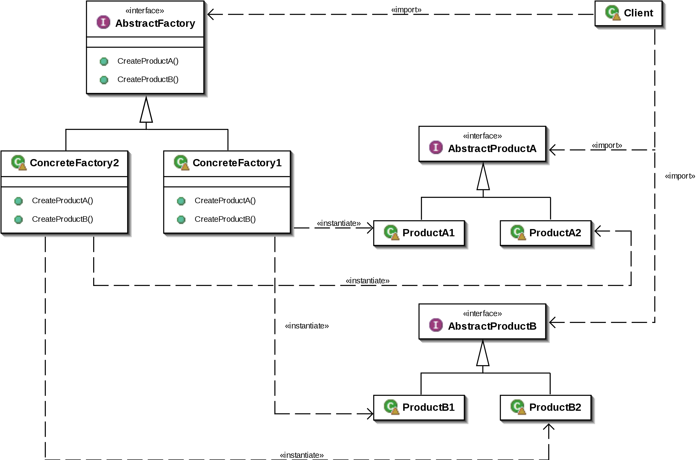

# 추상 팩토리 패턴

- 구체적인 클래스에 의존하지 않고 연관된 객체들의 조합을 만드는 인터페이스를 제공하는 패턴
- 연관된 객체들의 생성을 하나의 팩토리에서 담당

- AbstractFactory : 객체를 생성하는 여러 메소드들을 추상화 한다.
- ConcreteFactory : 타입에 맞는 객체를 반환하도록 메소드들을 재정의
- AbstractProduct : 각 타입의 객체들을 추상화한 인터페이스
- ConcreteProduct : 객체의 구현체

### 장점

1. 객체 생성 코드를 클라이언트에서 분리 가능
   - 쿨라이언트에서는 객체 생성에 대한 구체적인 정보를 알 필요가 없고, 추상 팩토리 인터페이스만을 사용하여 객체 생성 가능

2. 객체 생성 코드의 확장성 증가
   - 새로운 객체 종류를 추가하기 위해 팩토리 클래스와 관련 객체 클래스만 추가하면 됨
   

3. 객체간의 결합도를 낮출 수 있음

4. 구체 클래스에 대한 의존성 감소
   - 클라이언트는 추상 팩토리 인터페이스와 추상 객체 클래스에만 의존하므로 구체 클래스에 대한 의존성이 감소

### 문제점

1. 복잡도 증가
   - 많은 인터페이스와 클래스가 패턴과 함께 도입되기 때문에 코드가 복잡해짐

2. 유연성 감소
   - 객체 생성에 대한 인터페이스가 변경되면, 이와 관련된 모든 객체들을 수정해야 함 

### 결론
- 객체들의 생성이 서로 관련되어있고, 객체 생성 방법이 자주 변경되거나, 객체 생성과 사용이 분리되어야 하는 경우에 적합한 패턴