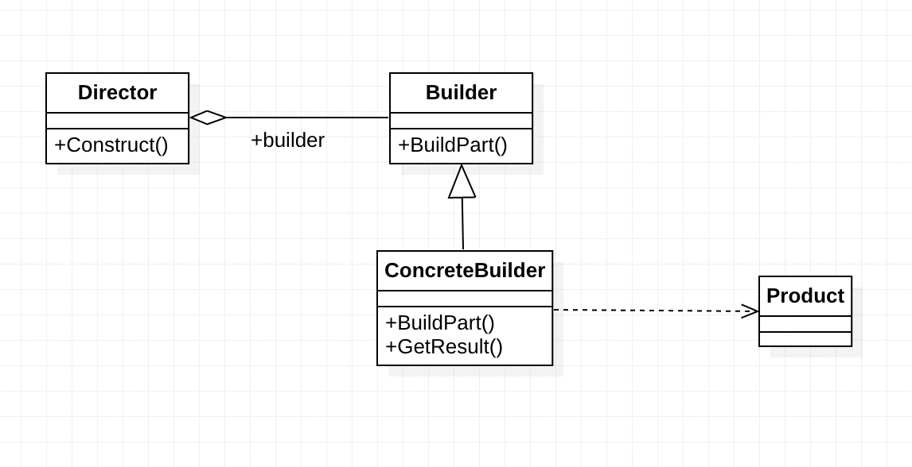

# 빌더 패턴

- 객체의 생성 과정과 표현 방법을 분리하여 다양한 구성의 인스턴스를 만드는 패턴

- Builder : Prouduct 객체의 요소들을 생성하기 위한 추상 인터페이스를 정의
- ConcreteBuilder
  - Builder에서 정의해둔 인터페이스를 구현
  - 생성한 요소의 표현을 정의하고 관리
- Director : Builder 인터페이스를 사용하는 객체를 합성
- Product : 빌더패턴을 이용하여 생성된 인스턴스

### 장점

1. 필요한 데이터만 설정 가능

2. 유연성 향상

3. 가독성 향상

4. 변경을 최소화할 수 있음

### 문제점

1. 클라이언트는 구체적인 인스터스를 생성하기 전 반드시 빌더를 생성해야 함

2. 관리해야 할 클래스의 수가 증가, 구조가 복잡해짐

### 결론
 - 복잡한 객체의 생성과정을 단순화하고 유연성을 높이기 위한 디자인 패턴
 - 객체 생성과 관련된 다른 디자인 패턴과 함께 사용 가능
 - 객체 생성 과정이 단순한 경우에는 적합하지 않음