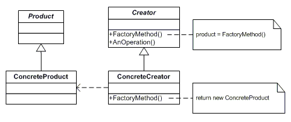

# 팩토리 메서드 패턴 

- 객체 생성을 Factory 클래스로 캡슐화 처리하여 생성을 위임하는 패턴

- Creator : Product 객체를 반환하는 팩토리 메서드를 선언하는 클래스
- ConcreteCreator : Creator 클래스의 인터페이스를 구현, ConcreteProduct의 인스턴스를 반환
- Product : 팩토리 메서드가 생성하는 객체의 인터페이스를 정의
- ConcreteProduct : Product 클래스의 인터페이스를 구현

### 장점

1.  확장에 열려있고 변경에 닫혀있음

2. 생성에 사용되는 공통로직들을 분류하여 공통화 가능
   - 중복되는 코드의 감소
   - 상속되는 모든 클래스가 동일한 로직을 사용함을 보장

3. 변화에 대응하기 좋음
   - 인터페이스를 상속하는 클래스만 더 생성하면 대응 가능

### 단점

1. 많은 클래스와 인터페이스가 생성됨

### 팩토리 메서드 VS 추상 팩토리
- 공통점
   - 두 패턴 모두 객체의 생성부를 캡슐화하여 결합을 느슨하게 할 수 있음
   - 구체적인 타입에 의존하지 않도록 함
  

- 차이점
   - 팩토리 메서드 패턴은 상속을 통해 서브 클래스에서 팩토리 메서드를 오버라이딩하여 객체의 생성부를 구현
   - 추상 팩토리 패턴은 객체의 집합을 생성하기 위한 정의를 추상부에 위치시키고, 하위의 구현부에서 세부적인 집합 생성 과정을 구현

### 결론
- 팩토리 메서드 패턴은 클래스간의 결합도를 낮추기 위해 사용
- 팩토리 메서드 패턴을 사용하면 객체 생성을 서브클래스에 위임함으로써 효율적인 코드제어가 가능하고 의존성을 제거할 수 있다.