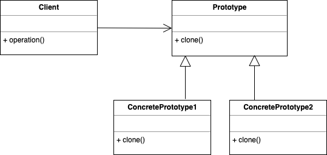

# 프로토타입 패턴

- 기본 원형이 되는 인스턴스를 사용해서 생성할 객체의 종류를 명시하고, 이렇게 만들어진 객체를 복사하여 새로운 객체를 생성하는 패턴

- Prototype : 임의의 인스턴스를 복제하는 메소드를 가진 인터페이스
- ConcretePrototype
  - Prototype 인터페이스를 구현. 
  - 원본 객체의 데이터를 복사하는 것 외에도 연결된 객체의 복사와 관련되 작업, 의존성 제거 등의 작업을 수행

### 장점

1.  구현 클래스에 직접 연결하지 않고 객체를 복사 가능

2. 프로토타입이 미리 정의되어 있어 중복되는 코드 제거 가능

3. 복잡한 오브젝트를 편하게 생성 가능

### 단점

1. 순환 참조가 있는 객체의 복사는 어려울 수 있음

### 결론
- 객체를 생성하는데 비용이 많이 들고, 비슷한 객체가 이미 있는 경우에 사용되는 패턴
- 데이터베이스에서 빈번하게 데이터를 가져오는 경우, 가져온 데이터가 똑같은 값을 반환하는 경우 활용 가능