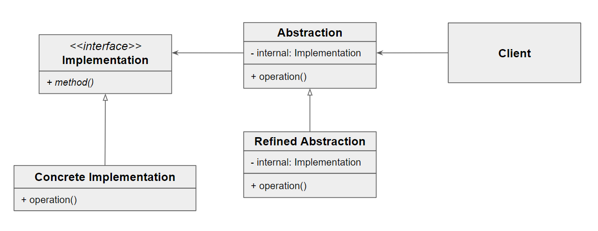

# 브리지 패턴

- 객체에서 동작을 처리하는 구현부와 확장을 위한 추상부를 분리하여, 객체의 확장성을 향상시킬 수 있는 패턴

- Abstraction : 기능 계층의 최상위 클래스, 구현 부분에 해당하는 클래스를 인스턴스를 가지고 구현부 메서드를 호출
- Implementor : Abstraction의 기능을 구현하기 위한 인터페이스 정의
- ConcreateImplementor : 실제 기능을 구현
- RefinedAbstract : 기능 계층에서 새로운 부분을 확장한 클래스

### 장점

1. 구현할 인터페이스에 완전히 결합시키지 않아, 구현과 추상부를 분리 가능

2. 추상부와 실제 구현부를 독립적으로 확장 가능

3. 추상화된 부분을 구현한 구상 클래스를 변경해도 클라이언트에는 영향을 미치지 않음

### 단점

1. 복잡성 증가

### 결론
 - 런타임에 실제로 사용될 구체적인 구현체가 결정되어야 할 때 유용
 - 구현할 클래스의 기능부 및 구현부가 지속적인 확장 가능성이 있을 경우 유용