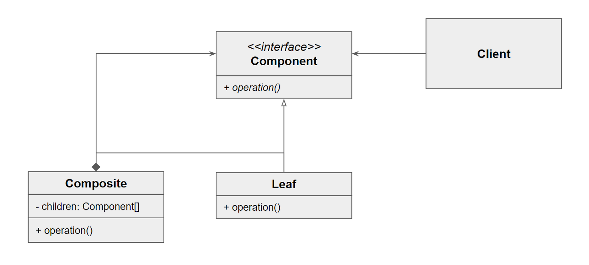

# 컴포지트 패턴

- 복합 객체를 구성하는 개별적인 객체들을 모두 동일한 방법으로 다룰 수 있게 하는 패턴

- Component : 개별 객체와 복합 객체의 공통적인 메소드를 정의
- Leaf : 개별 객체
- Composite : 복합객체

### 장점

1. 유연성
  - 객체의 구조를 변경하는데 유용
  - 새로운 개별 객체나 복합 객체를 추가하더라도 클라이언트는 코드를 수정할 필요 없음
  - 객체 간 결합도를 낮출 수 있음

2. 단순성
  - 개별 객체와 복합 객체를 동일한 방식으로 다룰 수 있음

3. 재사용성
  - 재사용성이 높은 구조를 만들 수 있음

4. 안정성
  - 복합 객체 내부의 구조를 안정적으로 유지 가능

### 단점

1. 비용
  - 복합 객체 내부의 모든 개별 객체를 처리해야하므로 비용이 증가

### 결론

- 전체-부분 관계(EX. 폴더-파일 관계)를 트리 구조로 표현하고 싶은 경우에 유용