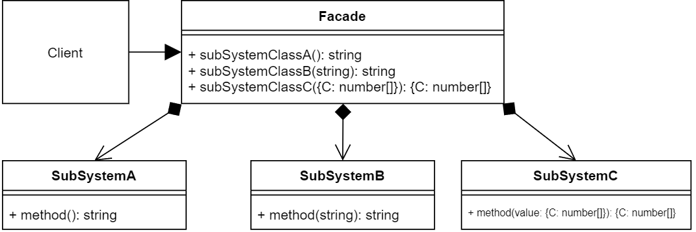

# 퍼사드 패턴

-  복잡한 클래스 라이브러리에 대해 사용하기 편하도록 간편한 인터페이스를 구성하기 위한 패턴

- Facade : SubSystem 클래스들을 혼합하여 클라이언트가 요청할 수 있는 메서드 제공
- Subsystem : 소프트웨어 라이브러리 또는 API의 집합, Facade를 통해 접근

### 장점

1. 낮은 결합도
    - 클라이언트는 서브 시스템들의 코드를 몰라도 됨
    - Facade 객체만 알면 사용이 가능함
    - 서브 시스템간의 결합도를 감소

2. 클라이언트가 서브 시스템을 사용할 때 다루어야 할 객체의 수 감소

### 단점

1. 클라이언트가 서브시스템 내부의 클래스를 직접 사용하는 것을 막을 수 없음

### 결론

- 복잡한 서브 시스템에 대해 간단한 인터페이스를 제공할 때 유용
- 서브 클래스간의 의존 관계가 많을 경우 이를 감소시킬 때 유용