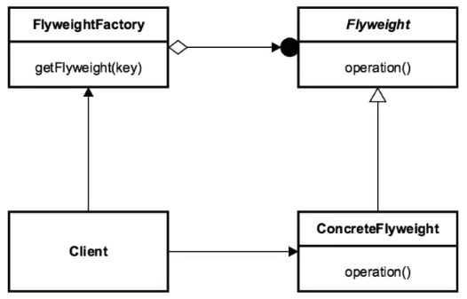

# 플라이웨이트 패턴

- 재사용 가능한 객체 인스턴스를 공유시켜 메모리 사용향을 최소화하는 패턴
- 자주 변하는 속성과 변하지 않는 속성을 분리하고, 변하지 않는 속성을 캐시하여 재사용해 메모리 사용을 줄이는 방식

- Flyweight : Flyweight의 공통된 메서드를 정의하고 Factory에 제공하는 인터페이스
- ConcreteFlyweight : 구체적인 Flyweight의 기능을 구현하고 실제로 사용될 객체
- FlyweightFactory : 해당 클래스를 사용해서 Flyweight의 인스턴스를 생성 또는 공유(캐싱)해주는 역할

### 장점

1. 애플리케이션에서 사용하는 메모리를 줄일 수 있음

2. 프로그램의 속도 개선 가능
   - 객체를 공유하면 인스턴스를 가져오기만 하면 되기 때문에 메모리 뿐만 아니라 속도도 향상 가능

### 단점

1. 코드의 복잡도 증가

### 결론

- 애플리케이션에 의해 생성되는 객체의 수가 저장 비용이 높아질 때 유용
- 생성된 객체가 오랫동안 메모리에 상주하며 사용되는 횟수가 많을 때 유용
- 공통적인 인스턴스를 많이 생성하는 로직이 포함되어 있을 경우에 유용