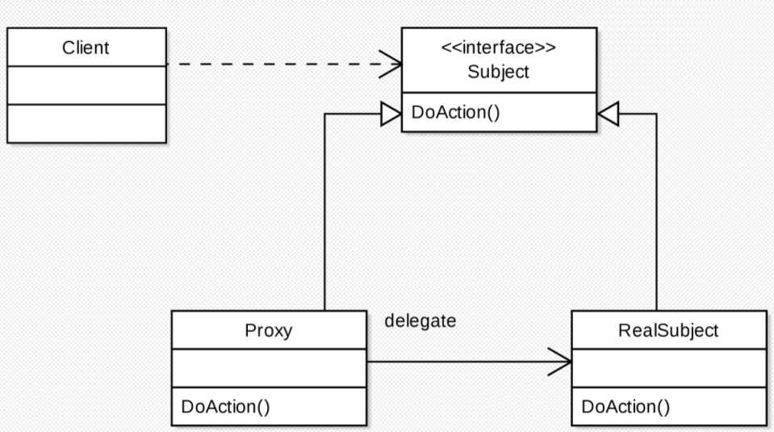

# 프록시 패턴

- 재사용 가능한 객체 인스턴스를 공유시켜 메모리 사용향을 최소화하는 패턴
- 자주 변하는 속성과 변하지 않는 속성을 분리하고, 변하지 않는 속성을 캐시하여 재사용해 메모리 사용을 줄이는 방식
- 프록시 패턴의 기본형을 어떤 방식으로 변형하느냐에 따라 종류가 나뉨
  - 가상프록시
    - 지연 초기화 방식
    - 가끔 필요하지만 항상 메모리에 적재되어 있는 무거운 서비스 객체가 있는 경우
    - 실제 객체의 생성에 많은 자원이 소모 되지만 사용 빈도는 낮을 때 쓰는 방식
    - 서비스가 시작될 때 객체를 생성하는 대신에, 객체 초기화가 필요한 시점에 초기화될 수 있도록 지연 가능
  - 보호 프록시
    - 특정 클라이언트만 서비스 객체를 사용할 수 있도록 하는 경우
    - 프록시가 대상 객체에 대한 자원으로의 엑세스 제어(접근 권한)
  - 로깅 프록시
    - 대상 객체에 대한 로깅을 추가하려는 경우
    - 프록시는 서비스 메서드를 실행하기 전달하기 전에 로깅을 하는 기능을 추가하여 재정의
  - 원격 프록시
    - 프록시 클래스는 로컬에 있고, 대상 객체는 원격 서버에 존재하는 경우
    - 프록시 객체는 네트워크를 통해 클라이언트의 요청을 전달하여, 네트워크와 관련된 불필요한 작업들을 처리하고 결과값만 반환
  - 캐싱 프록시
    - 데이터가 큰 경우 캐싱하여 재사용을 유도
    - 클라이언트 요청의 결과를 캐시하고 이 캐시의 수명 주기를 관리

- Subject :  Proxy와 RealSubject를 하나로 묶는 인터페이스
- RealSubject : 원본 대상 객체
- Proxy
  - 대상 객체(RealSubject)를 중계할 대리자 역할
  - 프록시는 대상 객체를 합성
  - 대상 객체와 같은 이름의 메서드를 호출하며, 별도의 로직을 수행 가능
  - 결과값을 조작하거나 변경하면 안됨

### 장점

1. 사이즈가 큰 객체가 로딩되기 전에도 프록시를 통해 참조 가능

2. 실제 객체의 메소드를 숨기고 인터페이스를 통해 노출 가능

3. 로컬에 있지 않고, 떨어져있는 객체 사용 가능

### 단점

1. 객체 생성이 잦을경우 성능이 저하될 수 있음

2. 프록시 내부에서 객체 생성을 위해 스레드의 생성과 동기화가 구현되는 경우 성능이 저하될 수 있음

3. 가독성 감소

### 결론

- 접근을 제어하거나 기능을 추가하고 싶지만, 기존의 객체를 수정할 수 없는 경우 유용
- 기존 객체의 동작에 수정 없이 추가하고 싶을 경우 유용